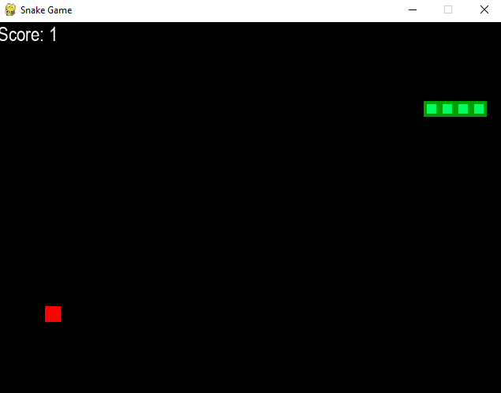

# Snake Game 

This is a simple implementation of the classic Snake game using the Pygame library in Python.

## Installation

1. Clone the repository to your local machine.
2. Install Pygame by running `pip install pygame` in your terminal or command prompt.
3. Run `python main.py` to start the game.

## How to Play

1. Use the arrow keys on your keyboard to move the snake.
2. The objective of the game is to eat as many apples as possible without colliding with the walls or yourself.
3. Each time you eat an apple, your score increases and the snake grows longer.
4. The game ends when you collide with a wall or yourself.

## Customization

You can customize certain aspects of the game by modifying the constants defined at the top of `main.py`. For example, you can change the size of the window, speed of the snake, and color scheme.

 

